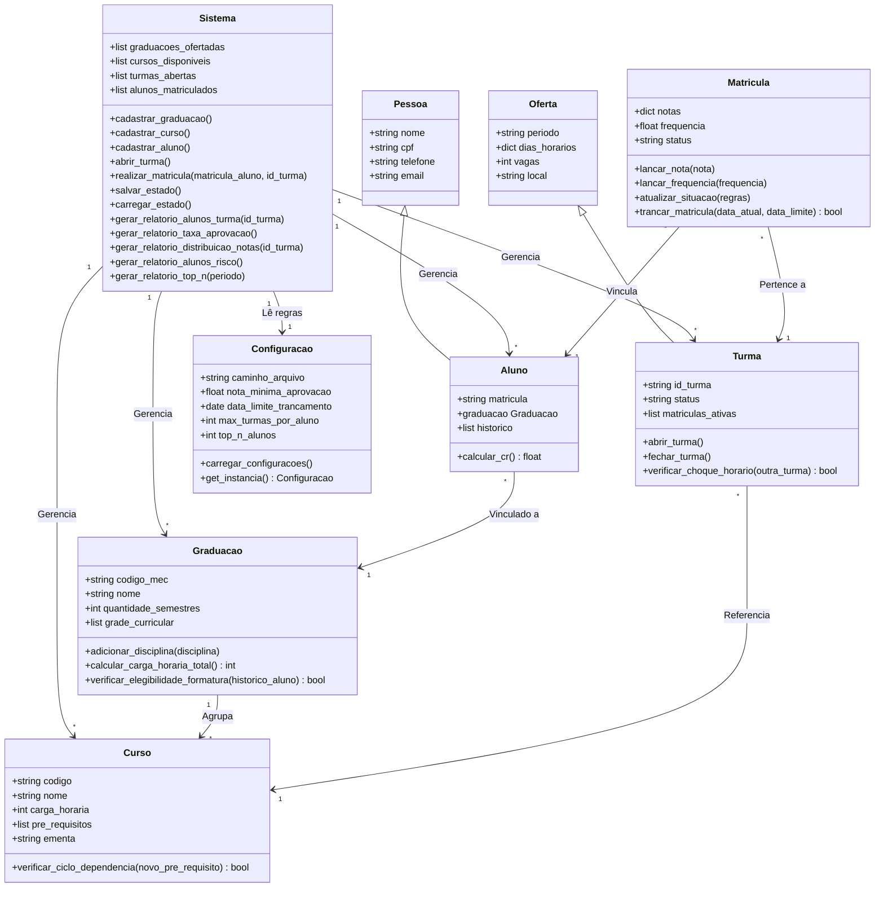

# Sistema Gerenciador de Cursos e Alunos

## Descrição

Este projeto é um sistema de gerenciamento acadêmico desenvolvido para aplicar e consolidar os conceitos de Programação Orientada a Objetos (POO). 

A aplicação foi projetada para administrar o fluxo de uma instituição de ensino, controlando desde as graduações e o catálogo de disciplinas até a abertura de turmas, efetivação de matrículas, acompanhamento de notas e frequência, além da geração de relatórios de desempenho e configuração de regras de negócio.

## Objetivo

O escopo principal deste projeto visa facilitar a administração de entidades acadêmicas, garantindo regras de negócio consistentes. Suas principais funcionalidades incluem:

- Cadastro e manutenção de graduações, disciplinas e alunos.
- Abertura e fechamento de turmas vinculadas às disciplinas.
- Controle rigoroso de matrículas, evitando choques de horário e verificando limites de vagas e pré-requisitos.
- Registro de acompanhamento acadêmico, englobando notas, frequências e status de aprovação.
- Trancamento de disciplinas respeitando prazos pré-estabelecidos.
- Leitura de parâmetros para aprovação e configurações a partir de arquivos externos.
- Geração de relatórios estatísticos sobre o desempenho das turmas e alunos.
- Persistência do estado do sistema (salvamento e carregamento de dados em formato JSON).

## Diagrama UML

Abaixo apresentamos a modelagem da arquitetura do sistema, detalhando as classes, seus atributos, métodos e as relações de herança e associação que conectam cada parte do domínio.

## Estrutura de Classes

A arquitetura do projeto foi dividida em grupos lógicos para facilitar o entendimento de cada responsabilidade.

### Pessoas e Alunos

Estas classes modelam os indivíduos que interagem ou fazem parte da instituição.

- `Pessoa`: É a classe base que concentra os dados de identificação comuns a qualquer pessoa, como nome, CPF, telefone e e-mail.
- `Aluno`: Especializa a classe Pessoa, adicionando uma matrícula única, o vínculo com o seu curso de graduação e um histórico acadêmico. Também possibilita o cálculo do próprio Coeficiente de Rendimento (CR) baseado nas disciplinas já cursadas.

### Catálogo e Oferta Acadêmica

Responsáveis por estruturar o que a instituição ensina e como isso é oferecido aos alunos em cada semestre.

- `Graduacao`: Representa o curso superior do mundo real. Atua como um agrupador lógico, guardando a grade curricular de disciplinas exigidas. Possui capacidade de calcular a carga horária total e verificar se o aluno cumpriu os requisitos para formatura.
- `Curso`: Representa a disciplina em sua essência. Guarda a ementa, carga horária e, principalmente, a lista de pré-requisitos para ser cursada a priori.
- `Oferta`: É a classe base responsável por dar vida a uma disciplina em um momento específico no tempo. Nela são centralizados os dados logísticos de qualquer turma que será aberta, como o período letivo, os dias da semana, a sala e o limite de vagas disponíveis.
- `Turma`: Herda de Oferta e concretiza a oferta de um Curso específico. Ela controla o seu próprio status (aberta ou fechada), gerencia as matrículas ativas nela e possui a lógica para impedir choques de horário com outras turmas.

### Vínculo Acadêmico

- `Matricula`: Atua como uma classe associativa, sendo a ponte que liga um Aluno a uma Turma. Guarda as notas e a frequência do aluno, atualiza o status de aprovação ou reprovação com base nas regras do sistema e gerencia a lógica de trancamento dentro do prazo estipulado.

### Controle, Gerenciamento e Relatórios

Classes responsáveis pelo funcionamento do sistema como um todo e pela persistência de informações.

- `Configuracao`: Responsável por isolar as regras de negócio parametrizáveis. Ela lê dados de um arquivo e garante que o sistema inteiro obedeça às mesmas definições de notas mínimas, prazos e limites.
- `Sistema`: É a classe principal de controle. Ela garante todo o funcionamento do programa, armazenando as listas de graduações, alunos, turmas e disciplinas em memória. É responsável pelas rotinas de criação, pela lógica de efetivar uma matrícula (checando todas as validações) e por percorrer os dados armazenados para gerar relatórios, além de salvar e carregar o estado do programa.

## Principais Relacionamentos

A modelagem reflete os princípios de Orientação a Objetos:

- Herança: `Aluno` estende as características de `Pessoa`, enquanto `Turma` estende as características de espaço e tempo da base `Oferta`.
- Associação: O sistema possui referências diretas em vez de apenas guardar códigos. Uma `Graduacao` agrupa diversos objetos da classe `Curso`. Uma `Turma` conhece o `Curso` ao qual pertence. Uma `Matricula`, por sua vez, conecta diretamente a instância de um `Aluno` com a instância de uma `Turma`.
